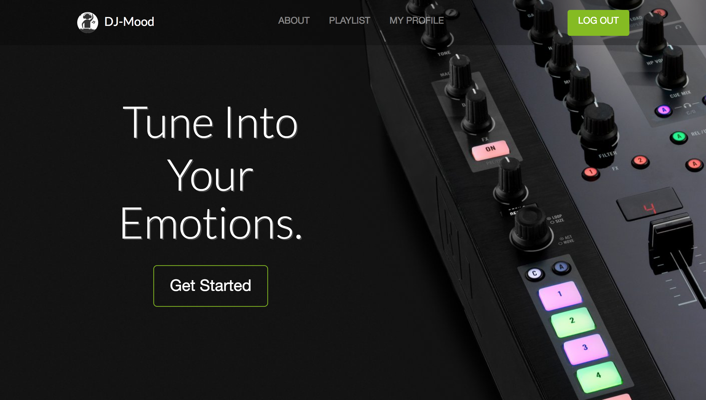

##Introduction

DJ Mood is an application that takes a short, 3 second video of the user's face. It then analyzes the emotions the user is displaying and uses the data to generate a playlist on Spotify. 

Building this application was done as part of a team of four. This application was also our final project at Dev Bootcamp.

##“DJ Mood”

##Emotions

We are using the Kairos Facial Recognition API to analyze the short clip the application takes. This returns information about all the faces in the video, including a reading of six basic emotions - joy, sadness, surprise, fear, contempt, and disgust - on a scale of 1 to 100.

Our algorithm then compares this output to our library of emotional states and determines which of those states it is 'closest' to - e.g. a face showing primarily 'joy' would be closest to our 'happy' state.

The closest state in our library then gets passed on to our music-picking algorithm and a playlist to suit this state is returned from there.

While there are only a few basic emotional states defined at the moment, this approach can be refined and expanded upon in the future.

##Music

DJ MOOD makes its selections via a lastFM tag search attuned to your emotional state. This search will return a random subset from a large collection of the top tracks, so the user will get a different playlist every time.

Once the tracks have been selected, a playlist is built via Spotify. This playlist is immediately displayed in an embedded player on the site, and it is added to the user's Spotify playlists for later playback.

Since the music is being sourced from Spotify, this app requires that users have a Spotify account and be logged into it. This is handled via the passport-spotify node package.

##User Preferences

DJ MOOD also provides users with the ability to configure the app's responses to their emotional state. These preferences alter the tag search that is triggered by each kind of emotional input - so for example, a user could request that the app play sad music when they are happy, or happy when they are sad. These preferences are linked to the user's Spotify login and will be saved in between uses.

##Technologies

DJ MOOD is built out of Javascript. The back end runs on an Express server which connects to a MongoDB database that stores user preferences. The front end views are built with the Pug view engine.

##Conclusion

We mainly used Ruby on Rails to build applications up until this point. Diving headfirst into Node, Express, JavaScript, and MongoDB was definitely a daunting task. It wasn't until after diving in did we suffer from callback hell. Being new to JavaScript while going through this project, we did not know of an alternative until after we were done with the project (Promises and Async Await). 

##Links

[> Github Source Code][1]  
[> DJ Mood][2]  

[1]: https://github.com/ThomasChang7/dj-mood
[2]: http://dj-mood.herokuapp.com/
