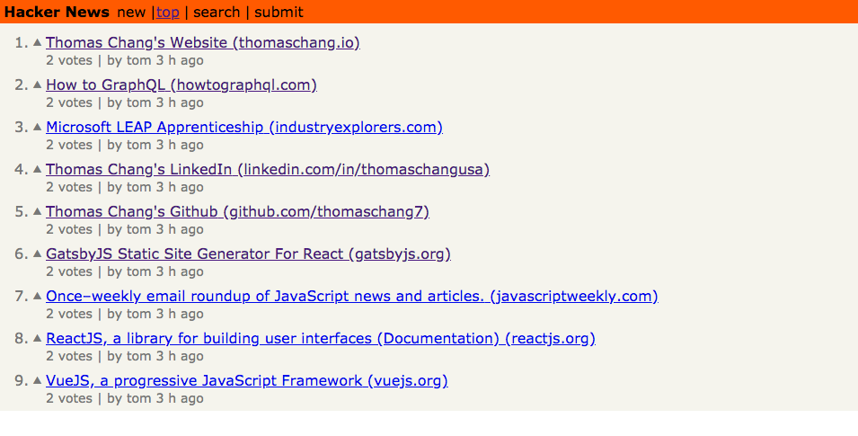

##Introduction

This project was done to get better at React and to learn GraphQL. GraphQL is definitely an awesome tool as it let's the developer decide on exactly what data to fetch so the client isn't overfetching data (especially on a data plan on their phone).

##“Hackernews Clone”

##Process

Most of the project was done following a tutorial on [How To Graph QL][1] 

The real challenge came from deploying the application onto Heroku. The project itself uses two servers, one for the client and one for the GraphQL server. When I wanted to deploy on Heroku, I did not want to take up 2 of my 5 precious slots on Heroku so I researched ways to deploy on one Heroku dyno.

I tried many things such as attempting to use Foreman. I was just about to just take up another Heroku slot but then it finally dawned on me that I can build the react components, make it static, and use the server to pull these static files in.

##Conclusion

GraphQL is very flexible and scales well with the rapidly changing requirements of the clients. Gone are the days of underfetching data and overfetching data!

##Links

[> Github Source Code][3]  
[> Hackernews Clone][2]  

[1]: https://howtographql.com
[2]: http://hackernews-apollo-react-node.herokuapp.com/
[3]: https://github.com/ThomasChang7/hackernews-react-apollo
