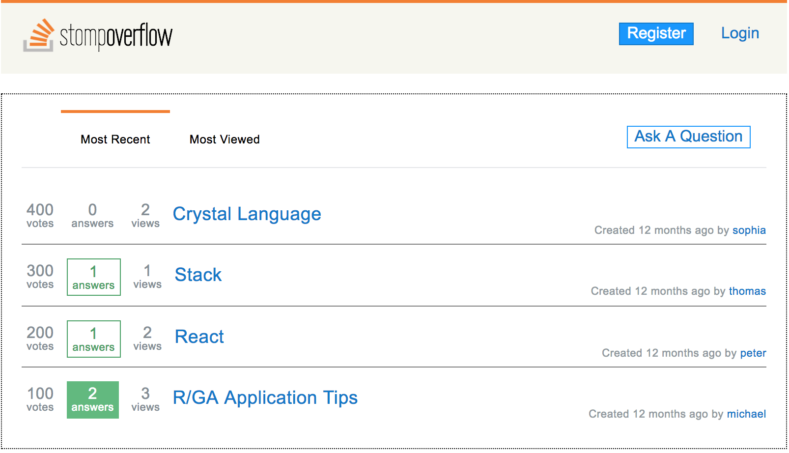

##Introduction

This was a project that was done with a team. The goal was to make a CRUD app using Sinatra (a lightweight ruby framework), jQuery, ajax, ActiveRecord, and Trello. We also wanted conceptually implement MVC.

##“SToMP Overflow”

This goal of this project was to make a Stack Overflow clone. We set out to make clean readable code while ensuring all of the functionality works. 

##Process

Our first step was to grab a whiteboard and map out the relationships between each object. For example, a User has many questions, answers, comments, votes and a Comment belongs to a user, a post, and etc. Working with the team was a challenge in itself because there had to be a lot of communication without stepping on anyone's toes. 

During the project, we used jQuery and Ruby to manipulate ajax requests and return partial code to the client in order to do a live update without refreshing the entire page. This was eye opening as it definitely shows how most of the web works these days. 

##Conclusion

Working with a team can be a challenge but also a pleasure. Being able to be a part of a team allows for dynamic collaboration and pooled knowledge. 

##Links

[> Github Source Code][https://github.com/ThomasChang7/stack_overflow_clone]  
[> The Launchpad Project][2]  

[1]: https://github.com/ThomasChang7/launchpad
[2]: https://stomp-overflow.herokuapp.com/
